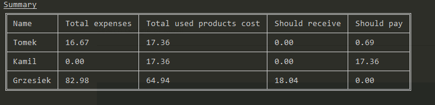
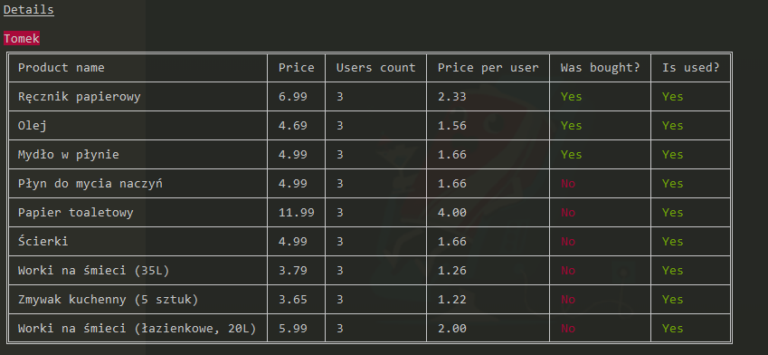

# Expenses splitter

Parses a CSV file with the list of purchased products and displays a summary with the cost for each
person.

May be used to easily split the household expenses at the end of the month.





## Installation

```bash
npm install -g expenses-splitter
```

## Usage

```bash
split-expenses <file-path> [options]
split-expenses --help
```

The file-path must be a path to a CSV file that contains the list of purchased products.

The recommended column layout is:

- product name
- product price
- buyer's name
- a column for each person with a value of `TRUE` of `FALSE` based on whether or not the person is
  going to use the product. The requirement is that the column name must contain the person name.
  For example, if `John` is in the list of people provided in the `names` argument, the column name
  can be `Is John included` or `Will John use?`

The columns may be in any order and have any name. There may also be additional columns.

The required options are:

- `names` - the names of people that may appear while splitting the bills
- `buyer-column-name`
- `price-column-name`
- `name-column-name` - the name of the product name column

There are short aliases for those options, see `split-expenses --help` for more information.

### Display details

By default only the summary table will be displayed. Pass the `--display-details` flag to display
per person summary of all the product he/she uses and purchased.

## Example

Given a file name `zakupy.csv` with the list of members:

- _Tomek_
- _Kamil_
- _Grzesiek_

the buyer column name _Kupujący_, the product's price column name _Kwota_ and the product's name
column name _Rzecz_, the following command may be used to display the summary:

```bash
split-expenses zakupy.csv -n Tomek Kamil Grzesiek -b Kupujący -p Kwota --name-column-name Rzecz
```

To display the details, use:

```bash
split-expenses zakupy.csv -n Tomek Kamil Grzesiek -b Kupujący -p Kwota --name-column-name Rzecz -d
```

## Contributing

Feel free to create issues and PRs.

## Author

The author of this project is Grzegorz Rozdzialik.
